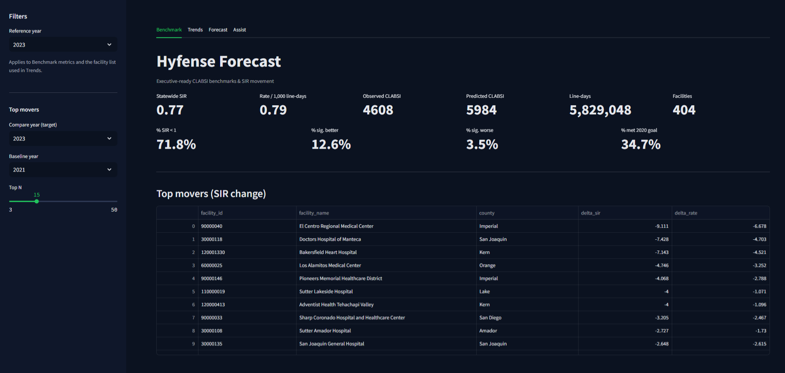

Correct the following (old) README.md file accordingly for this section and any other section that needs modifications.

# Hyfense Demo — CLABSI Benchmarks, Forecasting & RAG

A self‑contained demo that:
- Loads state CLABSI benchmark data (2021–2023).
- Serves a JSON API (FastAPI) for summaries, facility trends, top movers, and predictions.
- Provides a Streamlit UI with rich tables and plots.
- Adds a local “Assist” (RAG) tab over your project documentation.

> **Audience:** quality & safety leaders, infection preventionists, data/analytics teams, and reviewers.
> **Key idea:** make risk‑adjusted infection performance easy to read, trend, and forecast—then document everything and answer questions with RAG.

---

## Quick start

# 1) Create & activate venv
```
python -m venv .venv
```
```
.\.venv\Scripts\activate.bat
```

# 2) Install deps
```
pip install -r requirements.txt
```
# 3a) Run API 
#### [Terminal #1]
```
uvicorn app.api.main:app --reload --port 8000
```

# 3b) Run UI 
#### [Terminal #2]
```
streamlit run app\ui\streamlit_app.py --server.port 8501   
```  

---

## Directory tree (core files)

```
app/
  api/
    main.py                # API routes and logic.
    predict_router.py      # Forecast facility SIR with uncertainty.
    rag_router.py          # Docs Q&A (RAG) endpoints.
  ui/
    streamlit_app.py       # Streamlit front-end (pages and charts)
demo_data/                 # CLABSI CSVs and reports.
  clabsi/
    cdph_clabsi_odp_2021_2022_2023_clean.csv  # Cleaned dataset for app.
    cdph_clabsi_odp_2021_2022_2023.csv        # Raw CLABSI dataset (source).
    clabsi_dq_report.csv                      # Data-quality summary report.
docs/                      # End-user and RAG docs.
  README.md                # Project overview and guide.
  quickstart.md            # Install, run, and usage.
  methods.md               # Modeling and metrics explained.
  data_dictionary.md       # Column definitions and types.
  preprocessing_pipeline.md # Cleaning steps and rules.
  data_sources.md          # Source datasets and links.
  faq.md                    # Common questions answered.
 ./ README.md                # Project overview and guide.
    requirements.txt         # Python dependencies and versions.
    Dockerfile               # Build containerized app image.
    docker-compose.yml       # Run API + UI services.
```

---

## Environment variables

- `API_URL` — Frontend → API base URL (default `http://localhost:8000`).
- `CLEAN_CLABSI_CSV` — Path to cleaned dataset used by the API.
> Ensure the cleaned CSV exists at `demo_data/clabsi/cdph_clabsi_odp_2021_2022_2023_clean.csv`
(or set `CLEAN_CLABSI_CSV` to point to your file).
---

## API (FastAPI)

Base: `http://localhost:8000`

### Health & debug
- `GET /health` → basic status, CSV path, row count.
- `GET /debug/columns` → list of columns, years present, 3-row sample.
- `GET /predict/_debug` → predict subsystem info (years, rows).

### Benchmarks
- `GET /benchmark/summary?year=YYYY`  
  Returns statewide metrics for a year:
  - `statewide_SIR` (Observed / Predicted)
  - `rate_per_1000_line_days`
  - `observed_clabsi`, `predicted_clabsi`, `total_line_days`
  - `%` of facilities `SIR<1`, `% significantly better/worse`, `% met 2020 goal`

- `GET /benchmark/facilities?year=YYYY`  
  Facility list (id, name, county) that reported in the year.

- `GET /benchmark/facility/{facility_id}`  
  Facility per‑year aggregates (SIR, obs, pred, line_days, rates, gap, excess).

- `GET /benchmark/top-movers?year_from=YYYY&year_to=YYYY&n=N`  
  Largest changes in SIR (and rate if available).

### Predictions
- `GET /predict/sir?target_year=YYYY&model={naive|ridge|elasticnet|hgb}`  
  Per‑facility predictions with 90% prediction intervals (PI).  
  - **Backtesting**: choose a historical `target_year` to get **metrics** (`MAE`, `RMSE`, `n_eval`).  
  - **Forecasting**: choose the next year (no metrics, no ground‑truth yet).

**Models**
- `naive` — copies last year’s SIR; PI from residual std on train.
- `ridge` — closed‑form ridge on `[SIR_lag1, obs_rate_lag1, exp_rate_lag1]`; PI from train residual std.
- `elasticnet` (sklearn) — linear w/ L1+L2; 90% **conformal** PI width = 90th pct of |residuals|.
- `hgb` (sklearn) — HistGradientBoosting; 90% **conformal** PI width like above.

> If training rows are missing (e.g., first backtest year with no prior lag features), the endpoint falls back to the **naive** prediction per row and will state that in `model_note`. All numeric outputs are JSON‑safe (NaN/Inf → `null`).

---

## Streamlit UI — Tabs, controls & columns

### Tabs (left to right)
1. **Benchmark**  

      A quick, statewide snapshot for the selected year. See the big numbers at a glance—SIR (lower is better), 
      raw infection counts, line-days, and how many facilities met targets. 
      Use this to understand “how we did overall” before drilling into details.
2. **Trends**  

      Pick a facility and watch its story over time. You’ll see SIR trends and observed vs expected rates, plus a clean table you can sort or download. Use this to spot steady improvement, sudden changes, or gaps to investigate.
3. **Forecast**  

      Choose a target year and a model to estimate each facility’s next SIR. The table lists predictions and a 90% uncertainty range; charts highlight the riskiest facilities and where things might shift. Pick a past year to view backtest accuracy (MAE/RMSE) or the next year for a forward look.

4. **Assist** Q&A (RAG) / Legend & formulas 

      Ask questions in plain language and get answers grounded in the project’s docs (README, FAQ, methods, data dictionary, etc.). “Refresh index” after you edit docs. The Legend gives simple definitions and formulas so you can interpret every chart and metric with confidence.
### Common sidebar controls

- **Reference year** *(selectbox)* — sets the year for **Benchmark**, **Facility list**, and influences Facility Trend data.  
- **Top movers → Compare year (target)** *(selectbox)* — pick the newer comparison year.  
- **Top movers → Baseline year** *(selectbox)* — pick the older year. Change = SIR(target) − SIR(baseline).  
- **Top movers → Top N** *(slider)* — how many facilities to show.

### 1) Benchmark tab (cards + quick stats)

**Stats**
- **Statewide SIR** - `Observed / Predicted` infections (risk-adjusted), e.g. 0.77 → ~23% better than expected overall (lower is better).
- **Rate / 1,000 line-days** - Raw incidence scaled by exposure (Observed / Line-days × 1000), e.g. 0.79 → fewer than 1 infection per 1,000 line-days statewide.
- **Observed CLABSI** - Actual counted infections, e.g. 4608 → total infections recorded this year.
- **Predicted CLABSI** - Expected infections from the risk model, e.g. 5984 → benchmark you’re compared against; observed is lower (good).
- **Line-days** - Total central-line exposure time, e.g. 5,829,048 → large denominator; helps interpret rates fairly.
- **Facilities** - Hospitals reporting data, e.g. 404 → breadth of coverage for statewide metrics.

**Additional stats**
- **% SIR < 1** - Share of facilities < 1 (better than expected), e.g. 71.8% → most hospitals outperformed the benchmark.
- **% sig. better** - Share clearly better (95% CI fully under 1), e.g. 12.6% → a notable subset are statistically better.
- **% sig. / worse** - Share clearly worse (95% CI fully over 1), e.g. 3.5% → very few are statistically worse (good).
- **% met 2020 goal** — Share flagged as meeting the state’s CLABSI target, e.g. 34.7% → about one-third hit the formal goal.

**When it’s useful**
- A concise statewide snapshot tying risk-adjusted performance (SIR) to operational burden (rate per 1,000 line-days) and scale (line-days, facilities). Distribution stats (% SIR<1, % sig. better/worse, % met goal) show how widespread and statistically clear performance is. Use to compare years, set targets, and flag areas for deeper review.

### 2) Top movers tab (table)

Shows facilities with the largest SIR change between baseline and target years.

**Columns**
- `facility_id`, `facility_name`, `county`
- `delta_sir` — SIR(target) − SIR(baseline). Negative = improvement.
- `delta_rate` — rate(target) − rate(baseline) if rate is available in source.

**Tips**
- Sort by `delta_sir` ascending to see biggest improvers first.
- Use to prioritize peer outreach or internal review.

### 3) Facility trend tab (charts + raw data)

Pick a facility and explore its multi‑year history (2021–2023).

**Charts**
- **SIR over time** — lower is better; <1 = better than expected.
- **Observed vs Expected rate** — per 1,000 line-days; the gap is over/under performance.

**Raw facility data expander (table)**
- **Columns (renamed for clarity):**  
  - Year, **SIR**  
  - **Rate / 1,000 line-days**, **Expected rate / 1,000**  
  - **Rate gap (obs − exp)**  
  - **Observed**, **Predicted**, **Line-days**  
  - **Excess infections (Obs − Pred)**
- **Download button:** *“Download facility data (CSV)”*

**Use cases**
- Board packs, hospital report‑outs, QA audit lists, and hypothesis generation.

### 4) Predictions tab (controls, table, charts)

**Controls**
- **Target year** *(selectbox)* — choose a backtest year (historical) or next year (forecast).  
  - The very first data year is hidden (no prior year lag).  
  - **2022 is also hidden** from backtesting options in this demo because of limited lag/training rows.
- **Model** *(radio)* — `ridge`, `naive`, `elasticnet`, `hgb`.

**Header notes**
- If present, **Backtest metrics:** `n`, `MAE`, `RMSE`.  
- **Note:** per‑model training notes and fallbacks.

**Predictions table (top rows by default)**
- `facility_id`, `facility_name`, `county`, `year`
- `prev_year_sir` — last year’s SIR
- `pred_sir` — model estimate
- `pi90_lo`, `pi90_hi` — 90% prediction interval (uncertainty band)

**Charts**
1. **Scatter: Previous vs Predicted SIR**  
   - Diagonal y=x line helps spot upgrades/drops. Hover to see facility stats.
2. **Bar + error bars: Top predicted SIR (90% PI)**  
   - Focus attention on the highest predicted risk and its uncertainty.
3. **Histogram: Distribution of predicted SIR**  
   - See skew/tail and how many appear above/below 1.0.
4. **Bar: Change from previous year (Δ SIR = pred − prev)**  
   - Largest increases/decreases vs baseline.

**Why predictions matter (even naïve)**  
- Provides a **baseline** expectation with **uncertainty** to triage attention.  
- More advanced models (ElasticNet, HGB) try to use last‑year signals beyond SIR (rates) to refine predictions.

### 5) Q&A (RAG) tab

Ask natural‑language questions over your **local documentation** in `docs/`.

**Controls**
- **Your question** *(text input)* — e.g. “What is SIR and how is it computed?”  
- **Results** *(slider)* — top‑k chunks to use.  
- **Refresh index** *(button)* — re‑index docs after edits; shows “files” and “chunks” indexed.

**Outputs**
- **Answer** — synthesized response grounded on sources.
- **Sources** (table) — `rank`, `title`, `score`, `path`.
- **Matched chunks** (expanders) — show exact text used.

**How it works**
- The backend splits and embeds your Markdown files, performs vector search, and constructs an answer with citations.

### 6) Legend tab

Plain‑English definitions with simplified formulas:
- **SIR = Observed / Predicted**
- **Rate / 1,000 line-days = Observed / Line-days × 1000**
- **Rate gap = (Obs rate − Exp rate)**
- **Excess infections = Observed − Predicted**
- Interpretation: **SIR < 1** is better‑than‑expected; **SIR > 1** worse‑than‑expected.

---

## Frontend behaviors worth noting

- **ID formatting**: `facility_id` is printed without decimal artifacts (e.g., `123.0` → `123`).  
- **Numeric rounding**: most displayed metrics are rounded (3 decimals for ratios/rates).  
- **JSON safety**: non‑finite values (`NaN`, `Inf`) are converted to `null` by the API and the UI tolerates them.  
- **2022 hidden in predictions**: by design in the UI; useful to avoid confusing users when training rows are insufficient.

---

## Modeling details (short)

- **Features** used by models: previous year’s `SIR` and risk‑adjusted **rates**  
  - `SIR_lag1`, `obs_rate_lag1 = Infections_Reported/LineDays×1000`,  
  - `exp_rate_lag1 = Infections_Predicted/LineDays×1000`  
- **Naïve**: `ŷ = SIR_lag1`; PI = `ŷ ± 1.64 × σ(residuals)`  
- **Ridge**: closed‑form on above features; same PI style.  
- **ElasticNet / HGB**: sklearn fit; **conformal** width = 90th percentile of absolute training residuals.  
- **Fallbacks**: if a row lacks features, it uses the naïve value for that row (documented in `model_note`).

---

## Deploy

### Docker (local)
```bash
# build
docker compose up --build

```

### Render.com (free tier friendly)
- Create a **Web Service** for the API (FastAPI) and another for **Static/Streamlit**.  
- Set `API_URL` env var on the Streamlit service pointing to the API service URL.

> See `docs/quickstart.md` for full deployment notes.

---

## Troubleshooting

- **“Summary not available”** — The API didn’t find rows for the selected year. Check the CSV path and years present (`/debug/columns`).  
- **“Nothing to predict for target year”** — Year not in data and no “future” rows could be constructed.  
- **NaN/None in predictions** — Missing lag features; the API will fall back per row (noted in `model_note`).  
- **RAG returns no answer** — Click **Refresh index** in Q&A; confirm your `docs/` files exist.  
- **CORS errors** — Confirm the Streamlit `API_URL` matches the running FastAPI base URL.

---

## Glossary (short)

- **CLABSI**: Central Line‑Associated Bloodstream Infection.  
- **SIR**: Standardized Infection Ratio = Observed / Predicted (risk‑adjusted).  
- **Line‑days**: central‑line exposure time; used to scale raw rates.  
- **Backtesting**: evaluating predictions on a historical year with known outcomes.  
- **Prediction Interval (PI)**: plausible range for the prediction; wider = more uncertainty.  
- **Conformal**: distribution‑free interval based on empirical residuals.

---

## License & attribution

Demo code intended for educational/POC use. Data columns & definitions based on publicly reported CLABSI benchmarks (see `docs/data_sources.md`).

